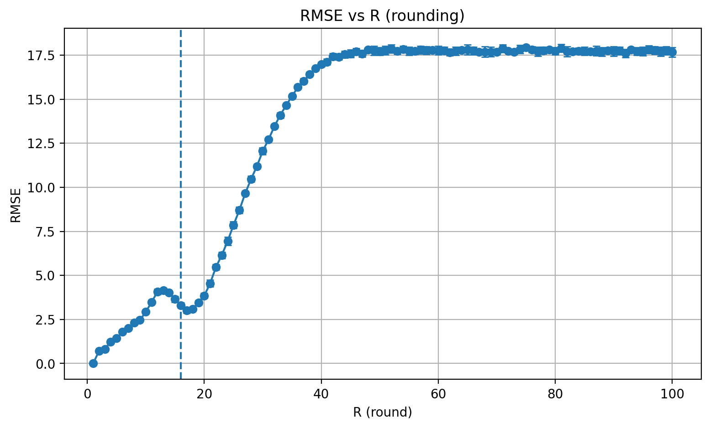
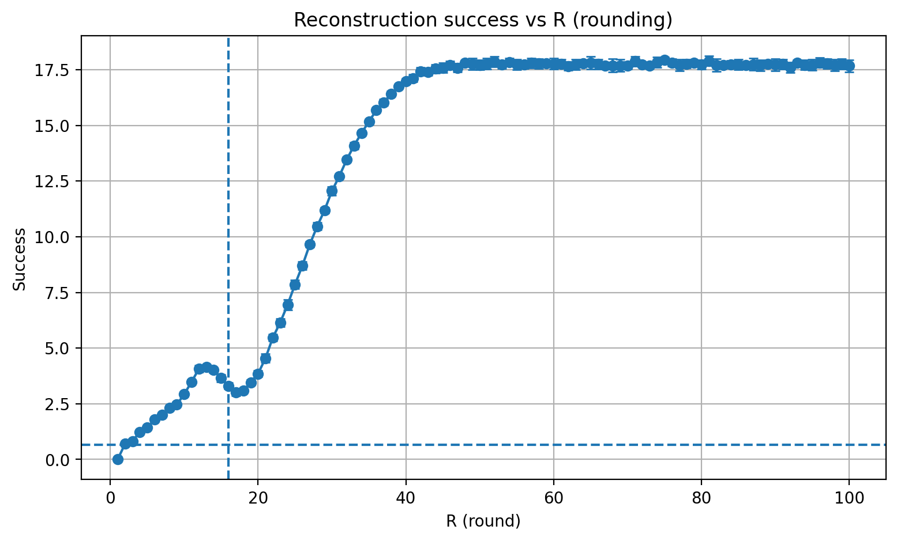
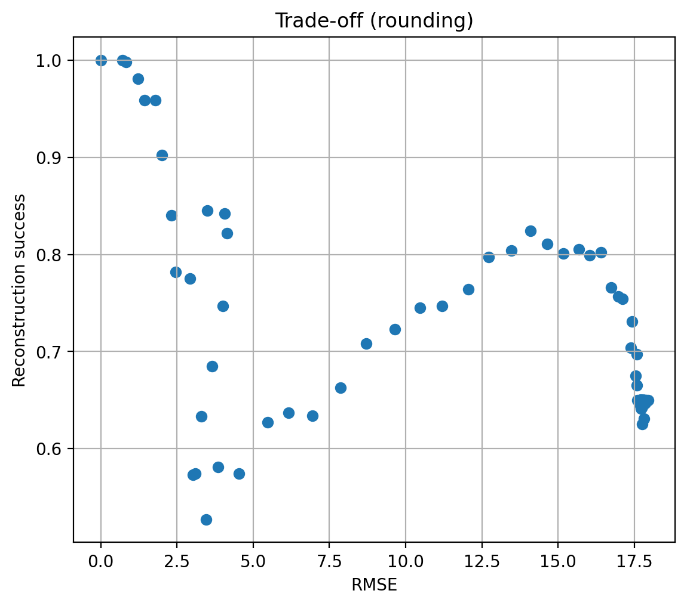
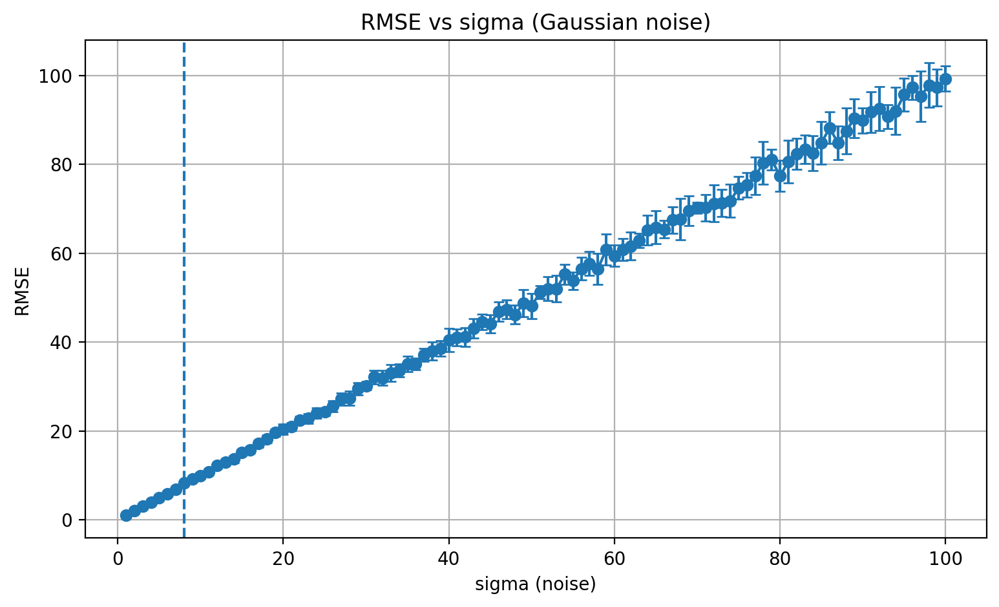
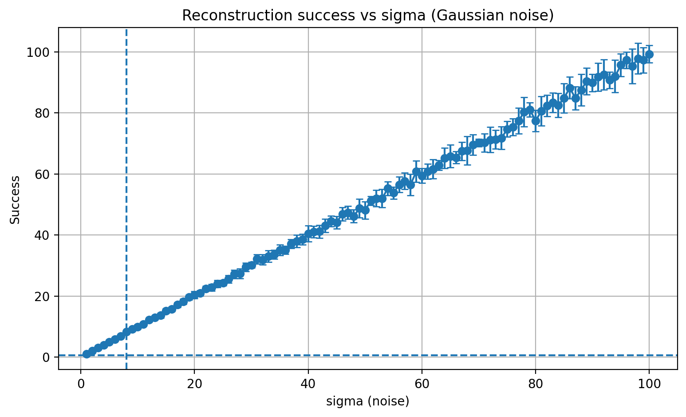
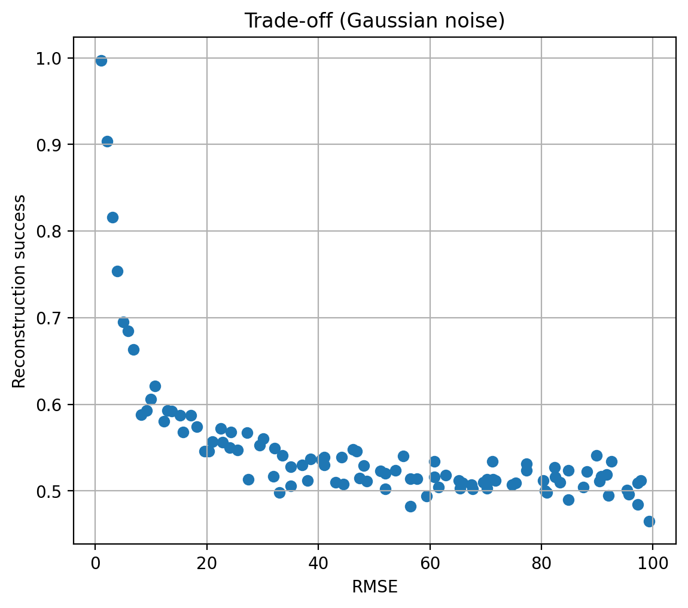
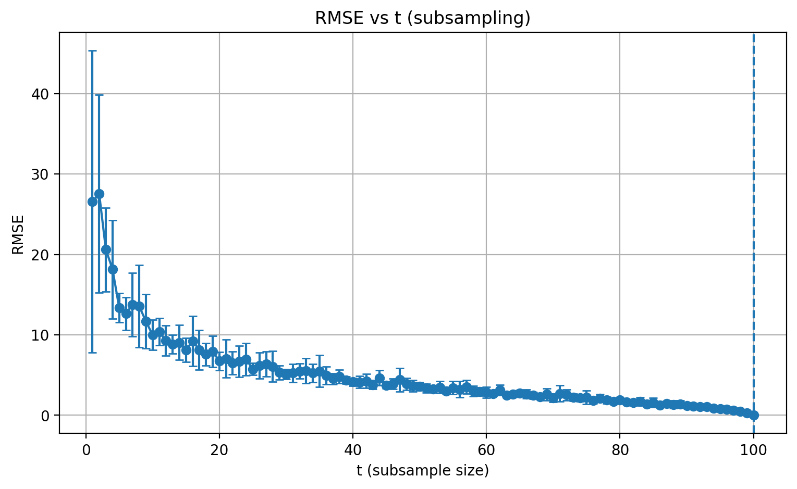
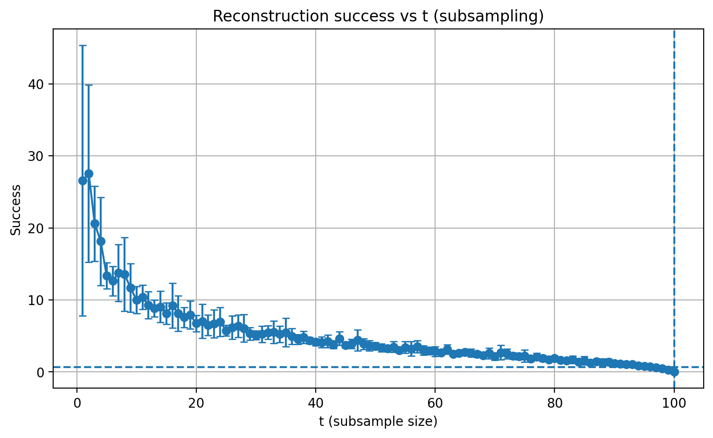
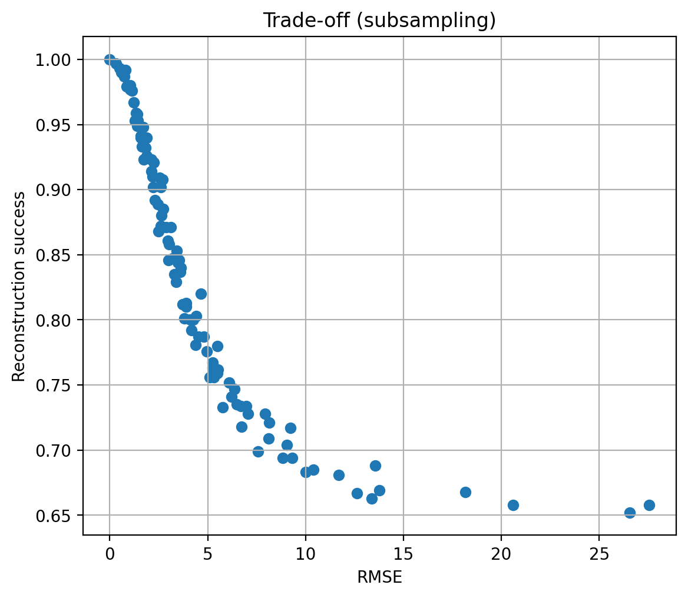

# CS5510 — Homework 1: Reconstruction Attack, Defenses, and Bayesian MIA

**Name:** Andrew Tarng, Ben Tran, Nicholas Ramirez-Ornelas, Kai Xue  
**Date:** 10/29/25  
**Repo:** https://github.com/atarng-cyber/CS5510-Homework-1

---

## 1. Dataset & Query Interface

**Dataset:** `fake_healthcare_dataset_sample100.csv` (n = 100).  
**Public attributes:** `age`, `sex`, `blood`, `admission`.  
**Sensitive attribute (target):** `result` ∈ {0,1} (0=normal, 1=abnormal).

**Data card (given):**

| Attribute      | Description                                                   |
|----------------|---------------------------------------------------------------|
| Age            | Integer in 0–100                                              |
| Sex            | 0: male, 1: female                                            |
| Blood type     | 0: A+, 1: A-, 2: B+, 3: B-, 4: AB+, 5: AB-, 6: O+, 7: O-     |
| Admission type | 0: elective, 1: urgent, 2: emergency                          |
| Test results   | 0: normal, 1: abnormal                                        |

**Query interface:** The curator answers **subset-sum queries** over the sensitive column:

**Answer(q)** = Σ₍ᵢ : q(i)=1₎ resultᵢ

Each predicate `q` is a boolean function on the **public attributes only** (e.g., `age > 34 and admission == 1`).  
We generate random predicates using the provided `make_random_predicate()` function.

---

## 2. Reconstruction Attack

We collect **k = 2n** random predicates *(q₁, …, qₖ)*.  
Let **A ∈ {0,1}ⁿˣᵏ**, where *Aᵢⱼ = 1* iff record *i* satisfies predicate *j*.  
Let **r ∈ {0,1}ⁿ** be the unknown sensitive column.

The interface returns **y ∈ ℝᵏ** with:

**y = Aᵀ r**

### Estimator

We solve the least-squares problem:

minimize ‖Aᵀx − y‖₂  
subject to x ∈ ℝⁿ

Then we clip the resulting vector **x̂** to [0, 1] and threshold at 0.5 to obtain binary predictions **r̂ ∈ {0,1}ⁿ**.

Implementation:  
`reconstruction_attack(data_pub, predicates, answers)` in `ps2_starter.py`.

---

## 3. Defenses Implemented

Given the exact answers **y**, we tested three defenses:

### (a) Rounding
  **ỹ = round(y / R) × R**  
Implemented as `execute_subsetsums_round(R, ...)`

### (b) Gaussian Noise
  **ỹ = y + η**, where η ~ N(0, σ²) independently  
Implemented as `execute_subsetsums_noise(sigma, ...)`

### (c) Subsampling
Randomly sample *t* out of *n* rows without replacement, compute subset sums on that subset, then scale by *n / t*:

**ỹ = (n / t) × Σ₍ᵢ∈T₎ 1[q(i)=1] · resultᵢ**

Implemented as `execute_subsetsums_sample(t, ...)`

---

## 4. Experimental Setup (Reproducible)

- **n:** 100 (dataset size)
- **Trials per parameter:** 10 (independent randomness each time)
- **Queries per trial:** k = 2n = 200
- **Parameter grid:** integers 1 … n for each defense  
  - Rounding: R ∈ {1, …, n}  
  - Noise: σ ∈ {1, …, n}  
  - Subsampling: t ∈ {1, …, n}
- **Metrics:**
  - **Accuracy:** RMSE between defended answers ỹ and exact answers y  
  - **Attack success:** (1/n) Σᵢ 1[r̂ᵢ = rᵢ]
- **Random seeds:** fixed for reproducibility (`numpy` and `random`).
- **Environment:** Python + numpy + pandas + matplotlib (version info in `pip freeze`).

**Outputs produced by `run_experiments.py`:**

| Output Type | Files |
|--------------|-------|
| Per-trial CSVs | `results_round.csv`, `results_noise.csv`, `results_sample.csv` |
| Summaries | `summary_round.csv`, `summary_noise.csv`, `summary_sample.csv` |
| Combined summary | `reconstruction_defense_summary_full.csv` |
| Plots | `rmse_vs_param_*.png`, `success_vs_param_*.png`, `tradeoff_*.png` |


---

## 5. Results

### 5.1 Majority baseline
Let *pₘₐₓ* be the proportion of the majority class in the `result` column:

**Majority baseline = pₘₐₓ = 0.65**

(This value is computed automatically and printed in the console by `run_experiments.py`.)

---

### 5.2 Rounding (parameter \(R\))

**Accuracy vs parameter (RMSE):**  


**Attack success vs parameter:**  
Horizontal line = majority baseline; vertical line = transition point R*.  


**Trade-off (Success vs RMSE):**  


**Transition point:**  
First R where avg success ≤ pₘₐₓ  
→ **R\*** = 16
 Avg success at R\*: 0.633

 ---
 
### 5.3 Gaussian Noise (parameter \(\sigma\))

**Accuracy vs parameter (RMSE):**  


**Attack success vs parameter:**  
Horizontal = majority baseline, vertical = transition σ\*  


**Trade-off (Success vs RMSE):**  


**Transition point:**  
**σ\*** = 8 
 Avg success at σ\*: 0.588

 ---

### 5.4 Subsampling (parameter \(t\))

**Accuracy vs parameter (RMSE):**  


**Attack success vs parameter:**  
Horizontal = majority baseline, vertical = transition t\*  


**Trade-off (Success vs RMSE):**  


**Transition point:**  
**t\*** = 100 
 Avg success at t\*: 1.0

---

## 6. Discussion: Utility–Privacy Trade-offs

- **Rounding:**  
  As R increases, RMSE rises in discrete steps and success drops from near 1 toward pₘₐₓ.  
  Around R\*, the attack becomes ineffective (no better than majority guessing).

- **Gaussian noise:**  
  Larger σ increases RMSE roughly linearly; success drops steadily.  
  Even moderate noise can collapse reconstruction accuracy while maintaining analytic utility for researchers.

- **Subsampling:**  
  Small t drastically reduces accuracy (large RMSE) and attack success ≈ pₘₐₓ.  
  As t → n, both RMSE → 0 and success → 1.  
  Subsampling offers a clear privacy–utility trade-off controlled by t.

The **“safe” regime** for each defense is where average success ≤ pₘₐₓ.  
Report numeric ranges near (R\*, σ\*, t\*) where success ≤ pₘₐₓ + 0.01.

---

## 7. Part 2 — Bayesian Interpretation of MIAs

Let the prior probability that Alice is in the dataset be *p*, with prior odds:

**O_prior = p / (1 − p)**

If the MIA outputs “In”, and we define:

- **TPR** = P(MIA says *In* | Alice in)  
- **FPR** = P(MIA says *In* | Alice not in)

then the posterior odds are:

**O_post = (TPR / FPR) × O_prior**

### Significance of very small FPR (even if TPR ≈ 1)

Because O_post scales by (TPR / FPR), a very small FPR leads to a huge odds multiplier.  
Thus, even one “In” result can make the adversary’s belief nearly certain.  
Maintaining a **low false positive rate** is therefore essential to keep posterior beliefs bounded.

---

## 8. Reproducibility

- Code: `ps2_starter.py`, `run_experiments.py`.
- How to run:
  ```bash
  python run_experiments.py
